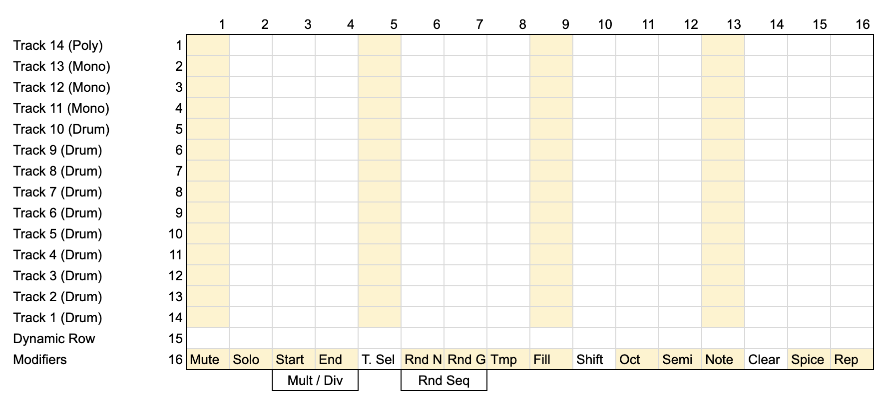

# permute

An improvisational grid sequencer for [monome norns](https://monome.org/docs/norns/) + grid (currently zero-only). 14 tracks, 16 steps, designed for live performance. It takes all of my favorite features from my favorite sequencers and boils them down to just the essentials I need for live performance of improvised techno.

## Overview

permute is a MIDI sequencer with 14 tracks (8 drum, 5 mono, 1 poly) laid out across a 16x16 grid. The bottom row (row 16) is a modifier row, row 15 is a dynamic context row, and rows 1-14 are track lanes. Tap steps to toggle gates, hold a step and use the dynamic row to set pitch/velocity.

Tracks send MIDI note data on configurable channels. Drum tracks send a fixed note with variable velocity. Mono/poly tracks send scale-quantized pitches.

## Install

```
;install https://github.com/discepoli/permute
```

## Controls

**Norns hardware:**
- **K2**: start/stop transport
- **K3**: toggle internal/external MIDI clock
- **E2**: change tempo
- **E3**: select track

## Grid Layout



| Row(s) | Function |
|--------|----------|
| 1-14 | Track step lanes (bottom = track 1, top = track 14) |
| 15 | Dynamic row (pitch/velocity/parameter editing) |
| 16 | Modifier row |

Tap a step to toggle it on/off. Hold a step and use row 15 to set pitch (melodic) or velocity (drum).

## Modifiers (Row 16)

Hold a modifier key and interact with tracks/steps to apply its effect. Some modifiers can be double-tapped to latch.

| Column | Modifier | Description |
|--------|----------|-------------|
| 1 | **Mute** | Mute/unmute a track |
| 2 | **Solo** | Solo a track |
| 3 | **Start** | Set a track's loop start point |
| 4 | **End** | Set a track's loop end point |
| 5 | *(Track select)* | Reserved for track selection context |
| 6 | **Rand Notes** | Randomize pitches/velocities on active steps. Use dynamic row to set intensity (1-16) |
| 7 | **Rand Steps** | Randomize which steps are active. Dynamic row sets density (1-16) |
| 8 | **Temp** | Add temporary steps that are removed on release. Double-tap to latch |
| 9 | **Fill** | Place fill steps that play only while Fill is held/latched. Double-tap to latch |
| 10 | **Shift** | Modifier combiner: Shift+Fill = save to slot (1-4), Shift+Temp = load from slot |
| 11 | **Octave** | Set octave offset for the selected track via dynamic row (center = 0) |
| 12 | **Transpose** | Transpose all melodic output by scale degrees via dynamic row (center = 0) |
| 13 | **Takeover** | Toggle takeover mode: zooms into the selected track as a full piano-roll/velocity grid |
| 14 | **Clear** | Clear the selected track's pattern. Clear+Shift clears all tracks. Clear+modifier clears that modifier's data |
| 15 | **Spice** | Set a per-step pitch drift amount via dynamic row, then tap steps to apply. Each time a spiced step plays, its pitch shifts cumulatively |
| 16 | **Beat Rpt** | Set a beat repeat/loop length (1-16 steps) via the dynamic row. Tracks loop within that window while held |

**Combo modifiers:**
- **Start + End** held together enters **Speed Mode** -- use the dynamic row to set per-track clock multiplier/divider
- **Rand Notes + Rand Steps** held together randomizes both simultaneously

## Scales

Four scale modes are available: chromatic, diatonic, pentatonic, and lightbath (a four-note subset: 1, 2, 5, 6). Scale degree/mode rotation is supported for non-chromatic scales.

## Parameters (norns PARAMS menu)

All settings are accessible via the norns params menu under the **permute** group:

| Parameter | Description | Default |
|-----------|-------------|---------|
| scale | Scale type (chromatic/diatonic/pentatonic/lightbath) | diatonic |
| key | Root note (C through B) | C |
| scale degree | Mode rotation (I, ii, iii, etc.) | I |
| tempo | BPM (30-300) | 145 |
| master length | Enable a global sequence length reset | off |
| master length steps | Steps before global reset (1-1024) | 128 |
| external midi clock | Sync to incoming MIDI clock | off |
| send midi clock out | Forward clock to MIDI output | on |
| send midi start/stop out | Forward transport messages | on |
| midi out port | MIDI output port (1-16) | 1 |
| melody gate ticks | Note length for melodic tracks in clock ticks (1-24) | 5 |
| drum gate ticks | Note length for drum tracks (1-12) | 1 |
| crow enabled | Enable crow CV output | off |
| crow out1/out2 track | Assign a track to crow outputs | 0 (off) |
| redraw fps | Grid refresh rate (10-60) | 60 |
| panic | All notes off | - |

**Per-track params** (under each `track N config` group):
- **track type**: drum, mono, or poly
- **midi channel**: 1-16
- **default note length**: 1-24 ticks

## Track Configuration

Default track layout is defined in `lib/config.lua` in the `TRACK_CFG` table. Edit this to change MIDI channels, note assignments, and default track types. Other constants like `NUM_TRACKS`, `NUM_STEPS`, scale definitions, and timing resolution are also in config.

## Presets

Presets save/load automatically through the norns PSET system. Pattern data, modifier states, save slots, and all sequence data are preserved.
