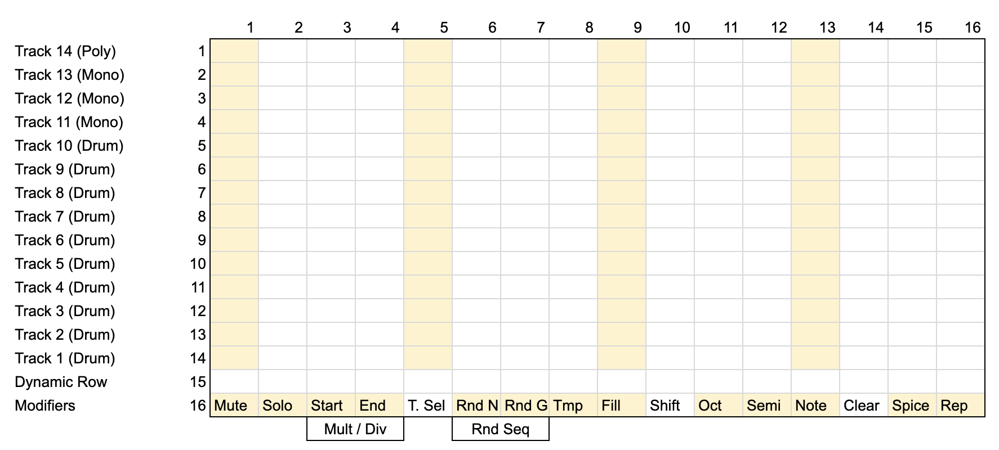

# permute

permute is a 14-track improvisational MIDI sequencer for [monome norns](https://monome.org/docs/norns/), grid, and optional Arc, crow, MIDI, or Launchpad Pro Mk3 devices.

## Quick start

```text
;install https://github.com/discepoli/permute
```

Connect a grid and your MIDI sound source, launch permute, then choose the output port in `PARAMS > permute > clock + midi`. Press K2 to start. The bottom row is track 1, the top row is track 14. Press a pad in a track row to add or remove a step.

On a 16×16 grid, row 15 is the dynamic row and row 16 is the modifier row. Hold a step and use the dynamic row to set a melodic step's pitch or a drum step's velocity. Hold modifier-row controls to mute, solo, randomize, change track range or speed, add temporary notes, and more.

Press the Takeover modifier to edit the selected track as a full-height pitch or velocity grid. Connect a 16×8 grid as an auxiliary editor for the selected track. Set `external midi clock` if another device provides transport, or hold K2 and press K3 to switch between internal and external clock.

Use `save as default` in the params menu to remember your usual device routing and track setup at startup. Save a norns PSET when you want to store a complete musical snapshot, including pattern data.



## Grid cheat sheet

On a 16×16 grid, rows 1-14 are tracks, row 15 is the dynamic row, and row 16 is the modifier row. On a 16×8 grid, rows 1-6 are tracks, row 7 is dynamic, and row 8 is modifiers.

| Column | Modifier | Hold it, then... |
| --- | --- | --- |
| 1 | Mute | Press a track to toggle mute. |
| 2 | Solo | Press a track to toggle solo. |
| 3 | Start | Press a step to set a track's first step. |
| 4 | End | Press a step to set a track's last step. |
| 5 | Track Select | Press a track to select it. Double-tap to toggle focus mode. |
| 6 | Random Notes | Use the dynamic row to randomize notes or velocity. |
| 7 | Random Steps | Use the dynamic row to randomize gates. |
| 8 | Temp / Fill | Hold alone for pattern slots. Hold with Shift for temporary notes or fills. |
| 9 | Ratios | Use the dynamic row to select a loop position and cycle. |
| 10 | Shift | Use with the combinations below. |
| 11 | Octave | Use the dynamic row to set the selected track's octave. |
| 12 | Transpose | Use the dynamic row to transpose the selected track. |
| 13 | Takeover | Enter the selected track's full-height editor. |
| 14 | Clear | Press a track or step to clear that track. |
| 15 | Spice | Use the dynamic row to choose accumulated pitch change, then assign it to steps. |
| 16 | Beat Repeat | Use the dynamic row to select a temporary repeat length. |

| Combination | Action |
| --- | --- |
| Start (3) + End (4) | Set the selected track's speed on the dynamic row. |
| Track Select (5) + Takeover (13) | Enter or leave the transpose sequencer. |
| Random Notes (6) + Random Steps (7) | Randomize both notes and gates from the dynamic row. |
| Shift (10) + Start (3) | Halve the selected track's length. |
| Shift (10) + End (4) | Double the selected track's length. |
| Shift (10) + Random Notes (6) | Set ongoing note-randomization probability and span. |
| Shift (10) + Random Steps (7) | Set ongoing gate-randomization probability. |
| Shift (10) + Temp / Fill (8) | Add temporary notes or fills, according to `temp button mode`. Double-tap to latch. |
| Shift (10) + Transpose (12) | Toggle external MIDI recording. |
| Shift (10) + Takeover (13) | Toggle realtime grid recording. |
| Shift (10) + Spice (15) | Undo. |
| Shift (10) + Beat Repeat (16) | Redo. |
| Shift (10) + Clear (14) | Clear every track. |
| Clear (14) + another modifier | Clear that modifier's data for the selected track. Add Shift (10) to clear it for every track. |

The [full manual](MANUAL.md) documents the grid, every modifier and combo, editing modes, external devices, parameters, defaults, and presets.
